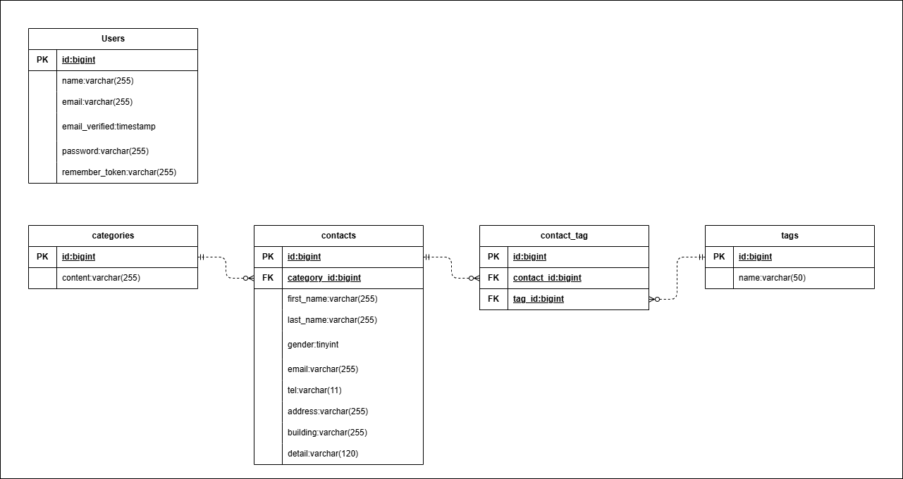

# COACHTECH　お問合せフォーム
## 概要
- お問い合わせフォームおよび管理者向け管理システムを実装したアプリケーションです。

---

### 主な機能
- お問い合わせフォーム
- お問い合わせ確認画面
- お問い合わせ登録
- 管理者ログイン機能
- お問い合わせ一覧表示
- 検索機能
- ページネーション機能
- お問い合わせ詳細取得API
- お問い合わせ作成API
- お問い合わせ更新API
- お問い合わせ削除API
- バリデーション機能
- テスト実装

---

## ER図


---

## 環境構築手順
### 前提環境
- Docker Desktop
- Git

### リポジトリのクローン
```bash
git clone https://github.com/tasuku1209/CONTACT-FORM-APP.git
```
### プロジェクトリポジトリへ移動
```bash
cd CONTACT-FORM-APP
```
### .envファイル作成
```bash
cp .env.example .env
```
### Composer install
```bash
docker run --rm \
    -u "$(id -u):$(id -g)" \
    -v "$(pwd):/var/www/html" \
    -w /var/www/html \
    laravelsail/php82-composer:latest \
    composer install --ignore-platform-reqs
```
### env設定について
Laravel Sailを使用しているため、以下のように設定してください。
```bash
DB_CONNECTION=mysql
DB_HOST=mysql
DB_PORT=3306
DB_DATABASE=laravel
DB_USERNAME=sail
DB_PASSWORD=password
```
### Sail起動
```bash
./vendor/bin/sail up -d
```
### NPM依存パッケージのインストール
```bash
./vendor/bin/sail npm install
```
### Vite開発サーバーの起動
```bash
./vendor/bin/sail npm run dev
```
### key生成
```bash
./vendor/bin/sail artisan key:generate
```
### migrate
```bash
./vendor/bin/sail artisan migrate:fresh --seed
```
### アクセスURL
http://localhost

---

## 使用技術
- PHP 8.x
- Laravel 10.x
- MyAQL　8.0
- Nginx
- Docker
- Laravel Sail
- PHPUnit

---

## APIエンドポイント一覧
| メソッド | パス | 概要 |
|---|---|---|
| GET | /api/v1/contacts | お問い合わせ一覧取得 |
| GET | /api/v1/contacts/{contact} | お問い合わせ詳細取得 |
| POST | /api/v1/contacts | お問い合わせ作成 |
| PUT | /api/v1/contacts/{contact} | お問い合わせ更新 |
| DELETE | /api/v1/contacts/{contact} | お問い合わせ削除 |

---

## 開発環境URL
http://localhost

---

## 作成者
- 高津　丞（たかつ　たすく）